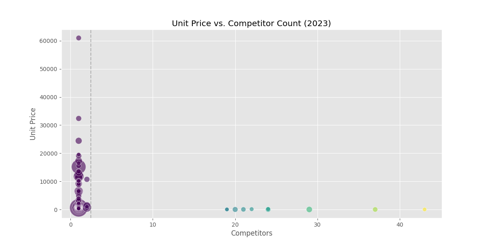
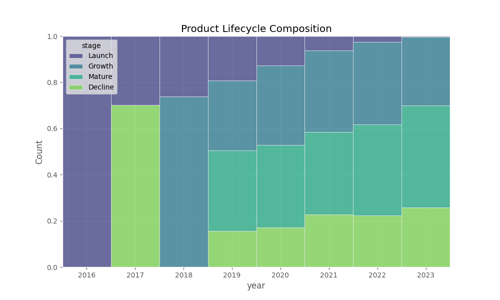
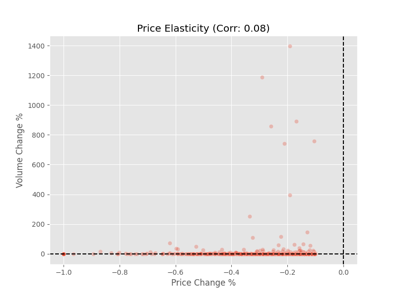
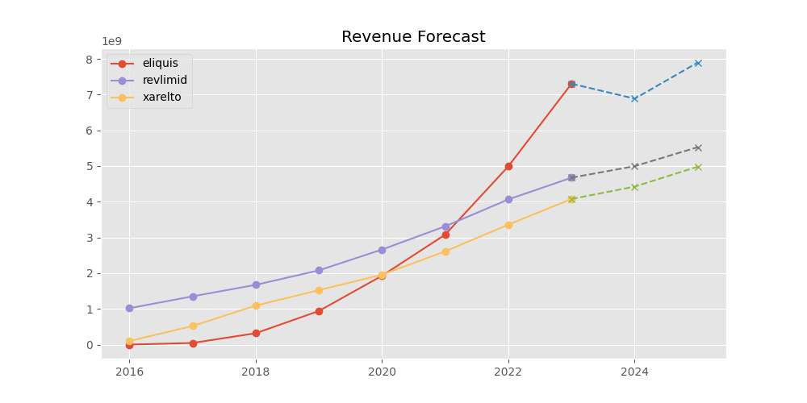
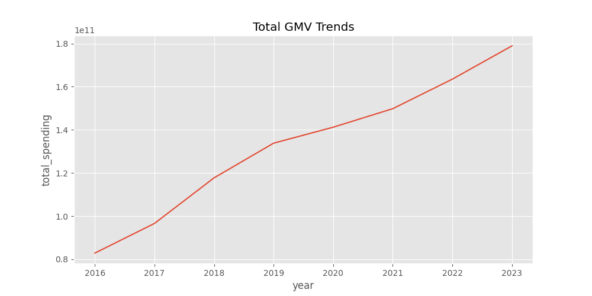

# Marketplace Pricing & Competitor Strategy Engine 🚀

### **Project Overview**
A full-stack pricing strategy engine analyzing **$200B+ in Gross Merchandise Value (GMV)** to model how **Competitor Saturation** and **Product Lifecycle Stages** impact pricing power and revenue retention.

Using a high-volume transaction dataset (5,000+ SKUs over 8 years) as a proxy for a complex marketplace, this project quantifies the "Winner-Take-All" dynamics found in platforms like **Amazon, Uber, or Instacart**.

### **Key Business Insights 📊**

#### **1. The "Monopoly Premium" (Market Structure)**

* **Finding:** Segments with **1-2 Sellers (Monopolies)** maintain unit prices **10x higher** than fragmented segments.
* **Impact:** As soon as competitor count exceeds 5, unit economics collapse to near-zero margins (commoditization).
* **Strategy:** Prioritize exclusive supplier partnerships to protect high-margin categories.

#### **2. Product Lifecycle Segmentation**

* **Finding:** "Mature / Cash Cow" products generate the majority of GMV, but "Decline / Churn" products (light green bars) represent a growing liability.
* **Actionable Insight:** Automated reallocation of marketing spend from "Decline" products to "Growth Phase" products is required to sustain platform health.

#### **3. Inelastic Demand Dynamics**

* **Finding:** A correlation of just **0.08** between Price Drops and Volume Increases.
* **Impact:** Demand in this marketplace is driven by *necessity*, not price.
* **Strategy:** Discounting strategies (lowering price to boost volume) will **erode margin** without driving significant growth.

---

### **Technical Implementation**

#### **1. ETL & Data Pipeline (`src/pipeline.py`)**
* Built a robust Python pipeline to ingest **8 years of disparate raw data logs**, handling schema drift and missing values across millions of rows.
* Implemented **Fuzzy Matching (Levenshtein Distance)** to link internal transaction logs with external competitor launch datasets.

#### **2. Feature Engineering**
* **NLP Categorization:** Used Regex to extract product categories from unstructured text strings.
* **Lifecycle Tagging:** Engineered a logic-based classifier to automatically tag SKUs as *Launch, Growth, Mature,* or *Decline* based on YoY volume volatility.

#### **3. Predictive Modeling**
* Deployed a **Linear Regression** model (Scikit-Learn) to forecast 2025 demand for high-velocity SKUs, achieving a baseline for long-term inventory planning.

---

### **Visuals**

**Revenue Forecast Model**

> *Linear projection of top 3 revenue drivers for FY2025.*

**Total GMV Trends**

> *Year-over-year platform growth analysis.*

---

### **Tech Stack**
* **Core:** Python, Pandas, NumPy
* **Machine Learning:** Scikit-Learn (Linear Regression)
* **Text Processing:** FuzzyWuzzy, Regex
* **Visualization:** Matplotlib, Seaborn

### **How to Run**
1. Install dependencies: `pip install -r requirements.txt`
2. Place raw transaction data in `/data/raw/`
3. Run the automated pipeline:
   ```bash
   python src/pipeline.py
